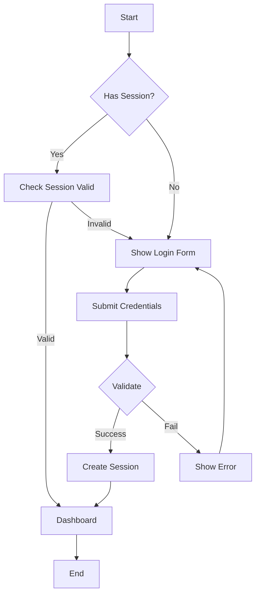
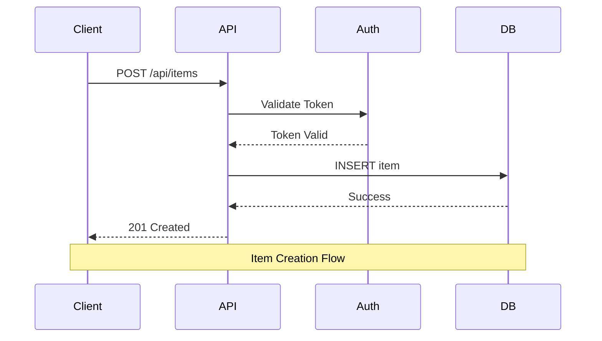
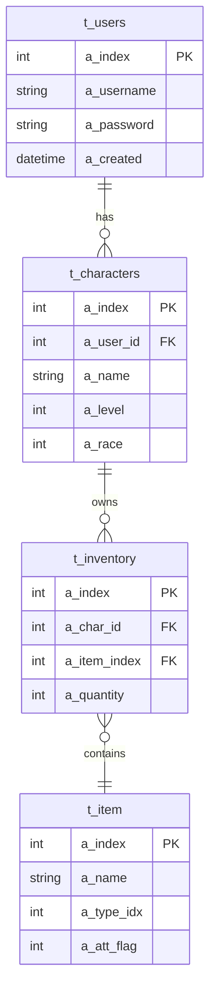
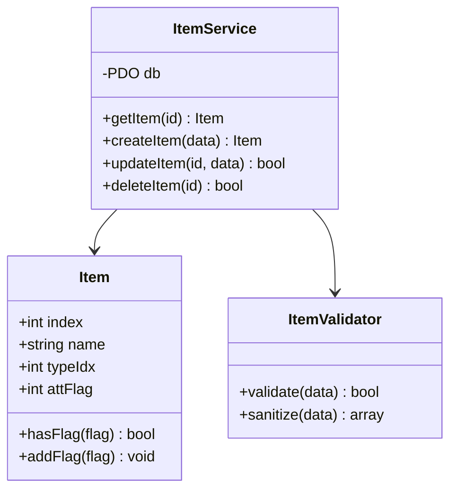
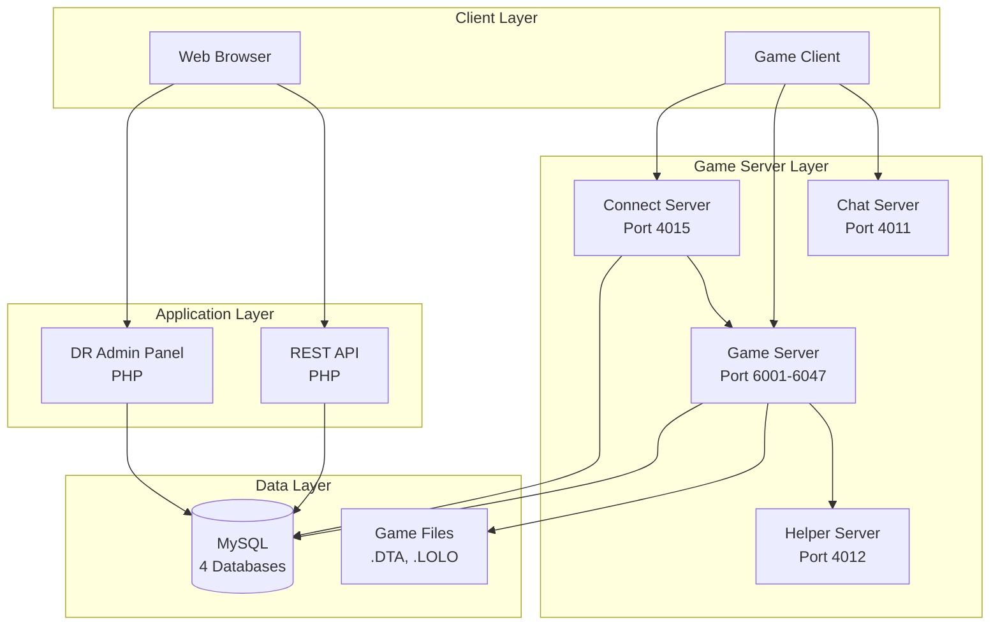
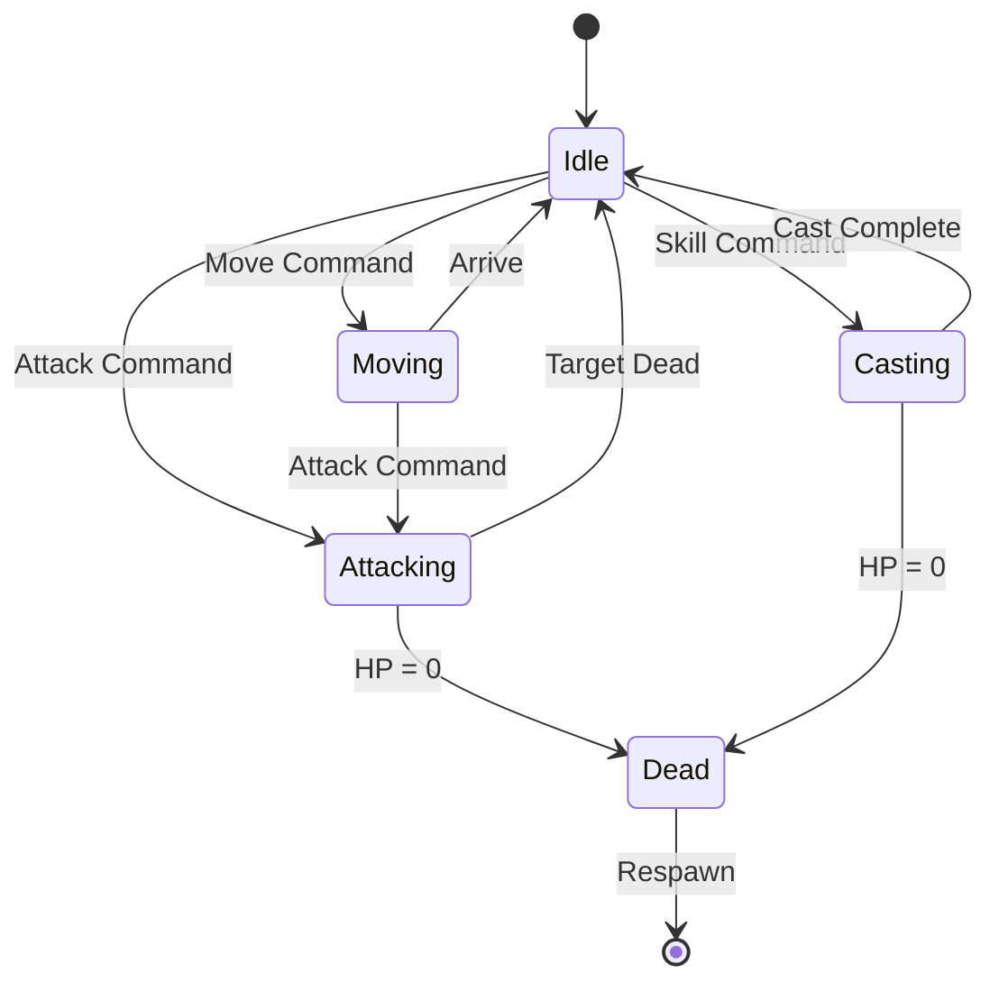
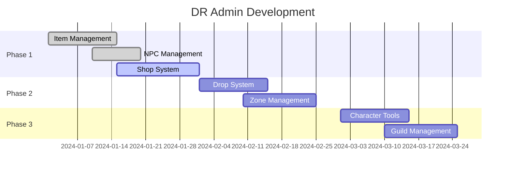
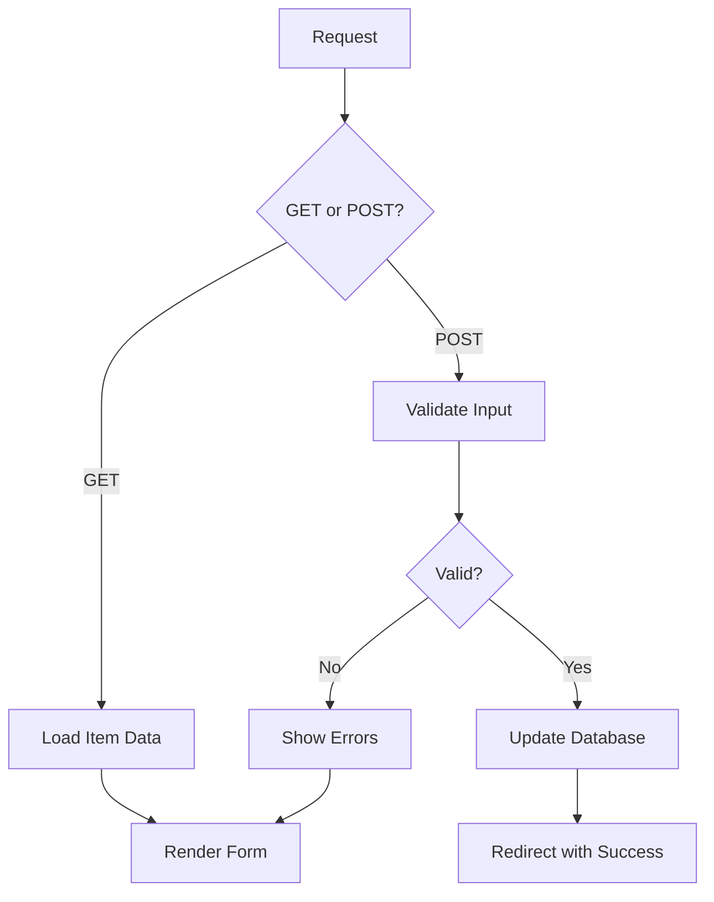

# Diagram Generator - สร้าง diagrams ด้วย Mermaid

## คำสั่ง
```
/diagram [type: flow|sequence|er|class|arch] <description or file>
```

## หน้าที่
สร้าง diagrams อัตโนมัติจาก code หรือ description โดยใช้ Mermaid syntax

## Diagram Types

### 1. Flowchart - ลำดับการทำงาน
```
/diagram flow login process
```

### 2. Sequence - การสื่อสารระหว่าง components
```
/diagram sequence api call
```

### 3. ER Diagram - Database schema
```
/diagram er t_item
```

### 4. Class Diagram - Class structure
```
/diagram class user module
```

### 5. Architecture - System overview
```
/diagram arch
```

## Output Format

### Flowchart
```markdown
## Login Flow


```

### Sequence Diagram
```markdown
## API Request Flow


```

### ER Diagram
```markdown
## Database Schema


```

### Class Diagram
```markdown
## Class Structure


```

### Architecture Diagram
```markdown
## System Architecture


```

### State Diagram
```markdown
## Character States


```

### Gantt Chart
```markdown
## Project Timeline


```

## Auto-Generate from Code

### From PHP File
```
/diagram flow public/edit_item_advanced.php
```

Output:


### From Database Tables
```
/diagram er t_item t_npc_drop t_zone_drop
```

## Rendering Options

### In Markdown
GitHub, GitLab, และ editors หลายตัว render Mermaid อัตโนมัติ

### Export to Image
```bash
# ใช้ mermaid-cli
npx @mermaid-js/mermaid-cli mmdc -i diagram.mmd -o diagram.png

# Online
# https://mermaid.live/
```

### In HTML
```html
<script src="https://cdn.jsdelivr.net/npm/mermaid/dist/mermaid.min.js"></script>
<script>mermaid.initialize({startOnLoad:true});</script>

<div class="mermaid">
flowchart TD
    A --> B
</div>
```

## ตัวอย่างการใช้งาน

```
/diagram flow login
/diagram sequence item purchase
/diagram er                        # All tables
/diagram er t_item t_shop
/diagram class utils/
/diagram arch                      # Full system
```

## Notes
- ใช้ Mermaid syntax มาตรฐาน
- Render ได้ใน GitHub/GitLab
- Export เป็น PNG/SVG ได้
- Auto-generate จาก code
